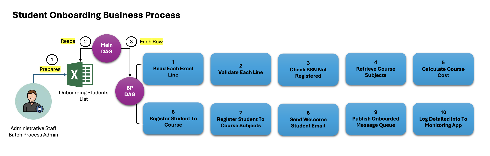

# Student Onboard Workflow - Apache Airflow Implementation

## Introduction
This repository contains Apache Airflow Directed Acyclic Graphs (DAGs) designed to automate the onboarding process for students enrolling in courses. 

The solution involves two primary DAGs: the **Main_DAG** and the **BP_DAG** (Business Process DAG).

Both the DAG's working in tandem to streamline student data processing and course enrollment.

## Business Process Understanding
This project automates repetitive onboarding tasks, ensuring smooth and efficient student enrollment, reducing human error, and integrating monitoring tools like Azure Event Hub and Grafana for end-to-end visibility.

Note: BP means Business Process

## Main_DAG Behavior
The Main_DAG reads an input Excel file, which contains key student information. For every student record, the Main_DAG invokes the BP_DAG to carry out specific tasks required for onboarding.

This Excel file may have up to 10,000 rows, each representing a student. 

### Excel columns
SSN, First Name, Last Name, Date of Birth, Email, Confirmed Course ID, Payment ID, Payment Amount, and Payment Date. 

## BP_DAG Behavior
The BP_DAG is responsible for executing the following sequential tasks:

1. Task_01: Check if the SSN is already registered for the course.
2. Task_02: Retrieve subjects associated with the course.
3. Task_03: Calculate the total cost of the subjects.
4. Task_04: Create a new student record in the system.
5. Task_05: Register the student for the course.
6. Task_06: Register the student for individual course subjects.
7. Task_07: Send a welcome email to the student.
8. Task_08: Send a message to Azure Event Hub confirming onboarding.
9. Task_09: Log detailed information to Grafana for monitoring.
10. Task_10: Closing dummy task for process finalization.

## This Codebase or Repository Structure

The repository is organized into multiple branches, each focusing on a specific variation of the student onboarding workflow. Each branch leverages a different technology stack to achieve the same business goal but with different infrastructure and architectural choices. This allows you to explore different ways of implementing and scaling the solution depending on the use case and technology preference.

### Branch Overview

- **Branch 01: student-onboard-with-af-dags**  
  Implements the basic student onboarding workflow using Apache Airflow for task orchestration.

- **Branch 02: student-onboard-af-invokes-springboot-api**  
  Integrates Apache Airflow with a Spring Boot-based microservice (`StudentOnboardBatchService`) to handle parts of the onboarding logic.

- **Branch 03: student-onboard-af-as-consumer-invokes-springboot-api**  
  Uses Apache Airflow as a consumer of messages from Azure Event Bridge, invoking the Spring Boot microservice for student onboarding.

- **Branch 04: student-onboard-azure-functions-invokes-springboot-api**  
  Implements Azure Functions to invoke the Spring Boot microservice for the onboarding process, replacing Airflow with serverless technology.

- **Branch 05: student-onboard-azure-functions-invokes-springboot-batch-api**  
  Extends the Azure Functions implementation by adding Spring Batch for batch processing of student onboarding data.

- **Branch 06: student-onboard-af-invokes-springboot-jbpm-bpmn-api**  
  Combines Apache Airflow with Spring Boot and JBPM BPMN to manage the business process workflow for student onboarding, utilizing BPMN standards.

### Common Technology Stack

All branches share the following common technology components:
- **Database**: Postgres is used to persist student data and transactional information across all workflows.

---

Each branch represents a unique workflow approach. You can switch between branches to explore how different stacks integrate with Airflow or serverless architectures to handle large-scale student onboarding scenarios.

